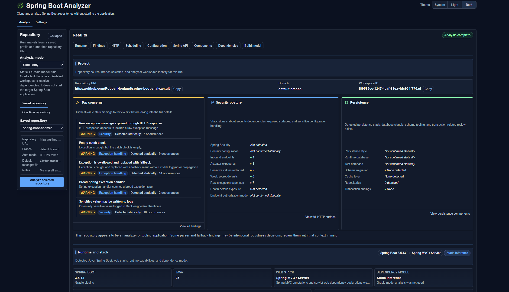

# Spring Boot Analyzer

[](https://github.com/RobbanHoglund/spring-boot-analyzer/actions/workflows/ci.yml)
[](LICENSE)
[](build.gradle)
[](build.gradle)

A static analysis tool for Spring Boot projects. Point it at any Git repository and get a structured report of findings, component inventory, HTTP surface, configuration risks, and anti-patterns — without running the analyzed application. 166 rules across 19 categories out of the box.

**Safe by default.** The default `STATIC_ONLY` mode clones the repository into a temporary workspace and performs static analysis only. It does not run Gradle tasks, Maven goals, tests, or the analyzed Spring Boot application. See [SECURITY.md](SECURITY.md) for the full security model.



---

## What it does

Spring Boot Analyzer clones a repository into a temporary workspace and inspects it using [JGit](https://www.eclipse.org/jgit/), [JavaParser](https://javaparser.org/), and optionally the Gradle Tooling API. It produces a prioritized list of findings across security, configuration, persistence, transactions, HTTP surface, and code quality.

**Default mode (`STATIC_ONLY`)** performs purely static analysis. It does not execute any code from the analyzed repository — no Gradle tasks, no Maven goals, no application startup, no test runs.

**Extended mode (`EXTENDED`)** is opt-in. It includes all static analysis and may use the Gradle Tooling API to resolve a richer Gradle model. This can evaluate repository-controlled Gradle build configuration logic. Use `EXTENDED` only for repositories you trust or inside an isolated sandbox.

See [docs/RULES.md](docs/RULES.md) for the full rule catalog.

---

## Features

### Component inventory
Detects Spring stereotypes and maps the application's component structure:
`@SpringBootApplication`, `@RestController`, `@Controller`, `@ControllerAdvice`, `@RestControllerAdvice`, `@Service`, `@Repository`, `@Component`, `@Configuration`, `@Entity`, `@ConfigurationProperties`

### HTTP surface analysis
- Inbound REST endpoints via Spring MVC (`@GetMapping`, `@PostMapping`, `@PutMapping`, `@PatchMapping`, `@DeleteMapping`, `@RequestMapping`)
- WebFlux functional routes (`route()`, `GET()`, `POST()`, etc.)
- Outbound HTTP calls via `RestTemplate`, `WebClient`, `HttpClient`, and `@FeignClient`
- Actuator endpoint exposure (`management.endpoints.web.exposure.*`)
- Base URL resolution from property placeholders

### Scheduling & messaging inventory
- `@Scheduled` methods: cron, fixedRate, fixedDelay, zone
- `@Async` methods (non-private)
- `@EnableScheduling` / `@EnableAsync` presence
- Message listener endpoints via `@KafkaListener`, `@RabbitListener`, `@JmsListener`, `@SqsListener` — destinations, group IDs, source locations

### Build analysis
- Gradle and Maven support
- Spring Boot version detection with confidence level
- Java version hint extraction
- Full dependency inventory

### Configuration analysis
- `application.properties` and `application.yml` parsing including profile-specific files
- Property placeholder resolution and cross-profile drift detection
- Sensitive value identification and redaction
- Spring configuration metadata catalog integration
- `@ConfigurationProperties` class extraction

### Gradle model analysis *(extended mode)*
- Resolved dependency tree via Gradle Tooling API
- Plugin declarations and version catalog support
- Java toolchain detection

---

## Findings

The analyzer produces **166 rules** across 19 categories. Each finding includes severity, confidence, why it matters, recommended action, evidence, and — for Gradle-model-backed rules — the exact resolved library versions involved.

| Category | Rules | Highest severity |
|----------|------:|-----------------|
| Security | 17 | ERROR |
| Configuration | 6 | ERROR |
| Profile drift | 8 | WARNING |
| Persistence | 11 | ERROR |
| Transaction | 12 | ERROR |
| Scheduling | 5 | WARNING |
| HTTP clients | 5 | WARNING |
| Exception handling | 10 | ERROR |
| Validation | 3 | INFO |
| Maintainability | 10 | ERROR |
| Observability | 9 | WARNING |
| Caching | 7 | ERROR |
| Testing practice | 5 | WARNING |
| Conditional beans | 2 | WARNING |
| Startup | 1 | WARNING |
| Actuator | 1 | WARNING |
| API surface | 3 | WARNING |
| Dependency compatibility | 2 | ERROR |
| Spring Boot 3 migration | 6 | WARNING |

See [docs/RULES.md](docs/RULES.md) for the complete rule catalog including detection logic, recommendations, and false-positive guidance.

---

## Requirements

| Component | Version |
|-----------|---------|
| Java | 25 |
| Node.js | 22 |
| Gradle | via wrapper (`./gradlew`) |

---

## CLI mode

Spring Boot Analyzer can run without the web server — useful for CI pipelines
and scripted workflows.

**Basic usage**

```bash
java -jar spring-boot-analyzer.jar --repo https://github.com/owner/repo.git
```

**All options**

| Option | Default | Description |
|--------|---------|-------------|
| `--repo` | *(required)* | Repository URL to analyze (HTTPS or SSH) |
| `--branch` | repo default | Branch to check out |
| `--username` | — | Username for HTTPS authentication |
| `--token` | `$ANALYZER_TOKEN` | Personal access token (or set env var `ANALYZER_TOKEN`) |
| `--mode` | `STATIC_ONLY` | Analysis mode: `STATIC_ONLY` or `EXTENDED` |
| `--format` | `text` | Output format: `text`, `json`, or `sarif` |
| `--output` / `-o` | stdout | Write output to a file instead of stdout |
| `--fail-on` | `error` | Exit 1 when findings at this severity or above exist: `never`, `info`, `warning`, `error` |
| `--quiet` / `-q` | false | Suppress progress messages written to stderr |

**Exit codes**

| Code | Meaning |
|------|---------|
| 0 | Analysis completed; no findings at or above `--fail-on` threshold |
| 1 | Analysis completed; at least one finding at or above the threshold |
| 2 | Analysis failed (clone error, auth failure, I/O error) |
| 4 | Invalid arguments |

**Examples**

Analyze a public repo and print a human-readable report:
```bash
java -jar spring-boot-analyzer.jar \
  --repo https://github.com/spring-projects/spring-petclinic.git \
  --branch main
```

Output SARIF for GitHub Code Scanning, fail on warnings:
```bash
java -jar spring-boot-analyzer.jar \
  --repo https://github.com/owner/repo.git \
  --token "$GITHUB_TOKEN" \
  --format sarif \
  --output results.sarif \
  --fail-on warning
```

Output raw JSON silently:
```bash
java -jar spring-boot-analyzer.jar \
  --repo https://github.com/owner/repo.git \
  --format json \
  --quiet \
  > analysis.json
```

In Docker (no web server started):
```bash
docker run --rm \
  -e ANALYZER_TOKEN="$GITHUB_TOKEN" \
  spring-boot-analyzer \
  --repo https://github.com/owner/repo.git \
  --format sarif \
  --output /dev/stdout
```

---

## Docker

Build and run with Docker (no local Java or Node.js required):

```bash
docker build -t spring-boot-analyzer .
docker run -p 8085:8085 spring-boot-analyzer
```

Open `http://localhost:8085/` for the UI.

**Pass custom configuration** (e.g. to configure workspace cleanup):

```bash
docker run -p 8085:8085 \
  -e ANALYZER_WORKSPACE_CLEANUP_MAX_AGE_DAYS=3 \
  spring-boot-analyzer
```

**Mount a workspace directory** if you want cloned repositories to persist across restarts:

```bash
docker run -p 8085:8085 \
  -v /tmp/analyzer-workspaces:/tmp/spring-boot-analyzer \
  spring-boot-analyzer
```

---

## Quick start

**Requirements:** Java 25, Node 22, Git.

**1. Start the backend**

macOS / Linux:
```bash
./gradlew bootRun
```

Windows (PowerShell):
```powershell
.\gradlew.bat bootRun
```

**2. Open the UI**

```
http://localhost:8085/
```

The UI is served by Spring Boot from `frontend/dist`. A pre-built frontend is included; run the full build below if you need to rebuild it.

---

## Building

**Build everything (frontend + backend)**

macOS / Linux:
```bash
cd frontend && npm install && npm run build && cd ..
./gradlew bootRun
```

Windows (PowerShell):
```powershell
cd frontend; npm install; npm run build; cd ..
.\gradlew.bat bootRun
```

**Run backend tests**

```bash
./gradlew clean test        # macOS / Linux
.\gradlew.bat clean test    # Windows
```

**Run frontend tests**

```bash
cd frontend && npm test
```

---

## Frontend development

The Vite dev server proxies `/api` requests to `http://localhost:8085`.

macOS / Linux:
```bash
# Terminal 1 — backend
./gradlew bootRun

# Terminal 2 — frontend
cd frontend
npm install
npm run dev
```

Windows (PowerShell):
```powershell
# Terminal 1 — backend
.\gradlew.bat bootRun

# Terminal 2 — frontend
cd frontend
npm install
npm run dev
```

Open `http://localhost:5173/` for the dev UI with hot reload.

---

## API

### Analyze a repository

```
POST /api/analyze
Content-Type: application/json
```

**Public repository**
```bash
curl -X POST http://localhost:8085/api/analyze \
  -H "Content-Type: application/json" \
  -d '{
    "repositoryUrl": "https://github.com/example/my-spring-app.git",
    "branch": "main"
  }'
```

**Private HTTPS repository**
```bash
curl -X POST http://localhost:8085/api/analyze \
  -H "Content-Type: application/json" \
  -d '{
    "repositoryUrl": "https://github.com/example/private-app.git",
    "branch": "main",
    "credentials": {
      "username": "octocat",
      "token": "ghp_..."
    }
  }'
```

**Extended analysis** *(includes Gradle dependency resolution)*
```bash
curl -X POST http://localhost:8085/api/analyze \
  -H "Content-Type: application/json" \
  -d '{
    "repositoryUrl": "https://github.com/example/my-spring-app.git",
    "branch": "main",
    "analysisMode": "EXTENDED"
  }'
```

**`analysisMode` values**

| Value | Description |
|-------|-------------|
| `STATIC_ONLY` | Default. Build file parsing, Java source analysis, configuration analysis. |
| `EXTENDED` | All of `STATIC_ONLY` plus Gradle Tooling API dependency resolution. |

### Fetch a source snippet

```
GET /api/analyses/{analysisId}/source-snippet?path=src/main/java/...&startLine=10&endLine=20&context=4
```

Returns a source snippet around a finding location. Used by the UI to render inline code previews.

---

## UI

The browser UI has three top-level views:

**Analyze** — Enter a repository URL and branch, optionally select a token profile, choose `STATIC_ONLY` or `EXTENDED` analysis mode, and run. Progress is streamed in real time.

**Results** — The report is divided into named sections accessible via a jump navigation bar (Runtime, Findings, HTTP, Scheduling, Configuration, Spring API, Components, Dependencies, Build model). Within the report:

- **Runtime stack** — detected web stack (Servlet MVC / WebFlux / unknown), Spring Boot version, Java version, virtual-threads status, and scheduling signals.
- **Findings** — filterable by severity (clickable toggle buttons for ERROR, WARNING, INFO), by category (dropdown with per-category counts), by runtime-detection confidence, and by free-text search. Findings can be grouped by rule. Each finding shows the rule ID, severity, confidence, explanation, recommendation, evidence, and an inline source preview with a direct link to the file on GitHub.
- **Dependencies** — summary cards, a managed-stack version grid (Spring Boot, Hibernate, Flyway, …), declared-dependency table, and a **collapsible dependency tree** grouped by Maven group ID. Spring groups are pinned to the top; groups with direct dependencies expand automatically. Existing filters (search, configuration selector, direct-only) apply before the tree is built.
- **Export** — copy findings as SARIF 2.1.0, download as JSON, or download a plain-text summary from the report header.

**Settings** — Manage HTTPS token profiles and saved repository profiles. Both are stored in browser `localStorage` and never sent to the backend except as part of an active analysis request.

---

## Suppressing findings

Add a `.analyzer-suppress.yml` file to the **root of the analyzed repository** to silence findings you've reviewed and accepted:

```yaml
suppress:
  - ruleId: SPRING_FIELD_INJECTION
    reason: "Legacy code — tracked for constructor-injection refactor in Q3"
  - ruleId: SPRING_JPA_OPEN_IN_VIEW
    reason: "Intentional: lazy loading required in view layer for this project"
```

Each entry requires a `ruleId` (the stable identifier shown in the UI and in SARIF output). The `reason` field is optional but recommended for auditability. Suppressed findings are removed from the report entirely; the count of suppressed findings is logged at INFO level on the server.

Rule IDs are listed in [docs/RULES.md](docs/RULES.md).

---

## Security model

- **No server-side credential storage.** HTTPS tokens are held in browser `localStorage` and transmitted only as part of an `/api/analyze` request. The backend does not persist them.
- **`STATIC_ONLY` mode (default) does not execute repository code.** It performs purely static analysis — no Gradle tasks, no Maven goals, no shell scripts, no application startup.
- **`EXTENDED` mode uses the Gradle Tooling API** to resolve dependency information. This may evaluate repository-controlled Gradle build configuration logic. Use it only for repositories you trust or inside an isolated sandbox. See [SECURITY.md](SECURITY.md).
- **Temporary workspaces.** Cloned repositories are written to a temporary workspace directory and cleaned up after analysis.
- **SSH repositories** use the SSH configuration of the server running the backend (e.g., `~/.ssh/known_hosts`, agent forwarding).

---

## Limitations

Spring Boot Analyzer is a static analysis tool. Its findings are advisory — not every finding is an actionable bug, and not every bug will be found.

- **Dynamic behavior is not visible.** Runtime decisions, reflection, and dynamic proxies cannot be fully analyzed statically.
- **Generated code is partially supported.** Lombok, MapStruct, and similar annotation processors generate bytecode that is not in the source tree. The analyzer reports this when the Gradle model confirms processors are present.
- **Multi-module projects have partial support.** Dependency resolution across modules requires `EXTENDED` mode and a working Gradle build.
- **Unconventional build setups may produce fewer findings.** The analyzer is optimized for standard Spring Boot projects.
- **All findings require human review.** Use the analyzer to focus attention, not to replace code review or testing.

See [docs/ARCHITECTURE.md](docs/ARCHITECTURE.md) for a deeper look at how analysis works.

---

## Tech stack

| Layer | Technology |
|-------|-----------|
| Backend | Spring Boot 3.5, Java 25 |
| Git operations | JGit 7.6 |
| Java source parsing | JavaParser 3.28 |
| Build introspection | Gradle Tooling API 9.5 |
| Frontend | TypeScript, Vite |
